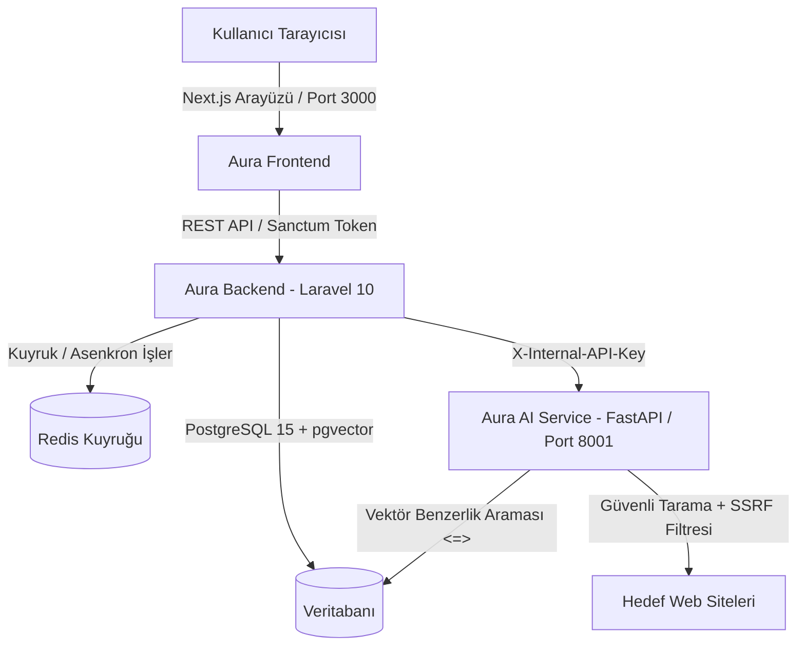

# 🌌 AURA — AI Unified Research & Audit

> **Kurumsal Doküman Analizi, Güvenli Web Sitesi Denetimi ve Yapay Zekâ Destekli Mevzuat Uyumluluk Platformu**

AURA, kurumların sahip olduğu teknik standartlar ve yönergeler ile gerçek web sitelerini yapay zekâ destekli analizlerle denetleyen, RAG (Retrieval-Augmented Generation) tabanlı doküman soru-cevap ve otomatik website audit platformudur.

---

## 🏗️ Sistem Mimarisi

### Katmanlar ve Teknolojiler:
* **Frontend:** Next.js (App Router, Turbopack), TypeScript, Tailwind CSS, Recharts, Lucide Icons.
* **Backend API:** PHP 8.2, Laravel 10, Laravel Sanctum, Redis Queues & Workers.
* **AI & Denetim Servisi:** Python 3.11, FastAPI, PyMuPDF, EasyOCR, Sentence Transformers, HTTPX, BeautifulSoup4, RAG Engine.
* **Veritabanı & Altyapı:** PostgreSQL 15 (`pgvector` vektör arama eklentisi ile), Redis 7, Docker Compose.

---

