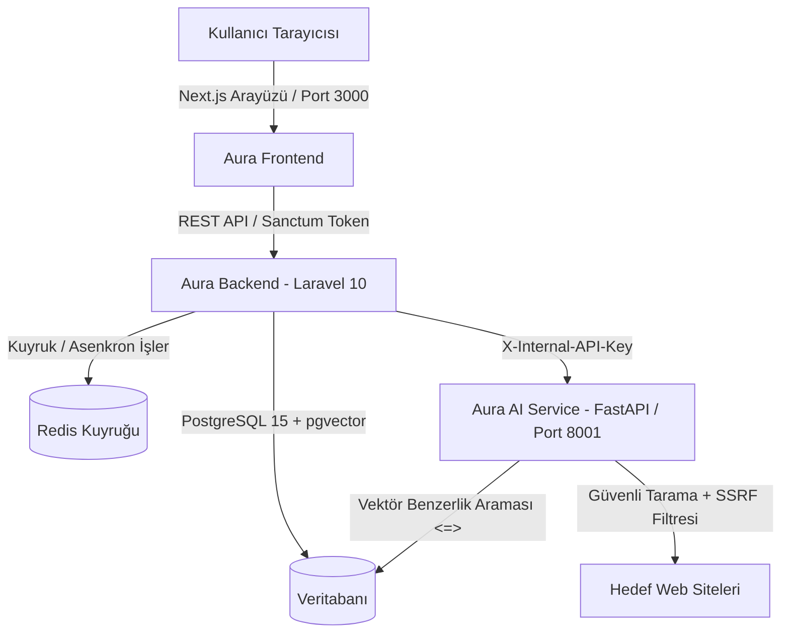

# 🌌 AURA — AI Unified Research & Audit

> **Kurumsal Doküman Analizi, Güvenli Web Sitesi Denetimi ve Yapay Zekâ Destekli Mevzuat Uyumluluk Platformu**

AURA, kurumların sahip olduğu teknik standartlar ve yönergeler ile gerçek web sitelerini yapay zekâ destekli analizlerle denetleyen, RAG (Retrieval-Augmented Generation) tabanlı doküman soru-cevap ve otomatik website audit platformudur.

---

## 🏗️ Sistem Mimarisi



### Katmanlar ve Teknolojiler:
* **Frontend:** Next.js (App Router, Turbopack), TypeScript, Tailwind CSS, Recharts, Lucide Icons.
* **Backend API:** PHP 8.2, Laravel 10, Laravel Sanctum, Redis Queues & Workers.
* **AI & Denetim Servisi:** Python 3.11, FastAPI, PyMuPDF, EasyOCR, Sentence Transformers, HTTPX, BeautifulSoup4, RAG Engine.
* **Veritabanı & Altyapı:** PostgreSQL 15 (`pgvector` vektör arama eklentisi ile), Redis 7, Docker Compose.

---

## 🚀 Hızlı Başlangıç (Docker ile 5 Dakikada Kurulum)

Projeyi sıfırdan ayağa kaldırmak için sisteminizde Docker ve Docker Compose kurulu olması yeterlidir:

```bash
# 1. Repoyu klonlayın ve klasöre girin
git clone https://github.com/RUAMELHEM/aura_projects.git
cd aura_projects

# 2. Ortam dosyasını oluşturun ve AI API anahtarınızı tanımlayın
cp .env.example .env
# .env dosyası içine OPENAI_API_KEY anahtarınızı girin

# 3. Tüm servisleri Docker ile arka planda başlatın
docker compose up -d --build

# 4. Laravel bağımlılıklarını kurun ve veritabanını hazırlayın
docker exec aura_app composer install --working-dir=/var/www/html/backend
docker exec aura_app php artisan migrate --seed

# 5. Uygulamaya erişin!
# Frontend: http://localhost:3000
# Backend API: http://localhost:8000/api
# Python AI Swagger Dokümantasyonu: http://localhost:8001/docs
```

---

## 👥 Roller ve Yetkilendirme (RBAC)

Sistem 3 temel kullanıcı rolünü destekler:
1. **Sistem Yöneticisi (`admin`):** Tüm kullanıcıları listeleme, departman atama, rol değiştirme ve tüm kurum sitelerini/dokümanlarını görüntüleme yetkisi.
2. **Kurum Yöneticisi (`kurum_yoneticisi`):** Kendi departmanındaki kullanıcıları listeleme, departman audit istatistiklerini izleme.
3. **Çalışan (`calisan`):** Doküman yükleme, yapay zekâ ile sohbet etme, web sitesi ekleme ve tarama başlatma.

---

## 🎯 Uçtan Uca Kabul Testi Senaryoları

Sistemde öne çıkan 3 kritik kullanım senaryosu:

### 📄 Senaryo 1: Doküman Yükleme & RAG Tabanlı Soru-Cevap
1. [Dokümanlarım](http://localhost:3000/dashboard/documents) sayfasına gidin ve bir PDF/DOCX dosyası yükleyin.
2. Kuyruk işçisi (Redis Worker) dokümanı işler (`processing` → `processed` sayfa yenilenmeden otomatik güncellenir - **Canlı Durum Polling**).
3. [Yapay Zeka Sohbet](http://localhost:3000/dashboard/chat) sayfasına gidin ve yeni bir sohbet başlatarak dokümanla ilgili bir soru sorun.
4. Yapay zekâ yanıtının altında **hangi dokümanın hangi sayfasından alıntı yapıldığını ve benzerlik skorunu** görebilirsiniz (**Kaynak Referansı / Grounding**).
5. Dokümanda yer almayan bir konu sorulduğunda model halüsinasyon görmez; *"Bu bilgi yüklenen dokümanlar içerisinde bulunamadı"* yanıtını verir.

### 🌐 Senaryo 2: Web Sitesi Denetimi & Audit History Grafiği
1. [Web Sitelerim](http://localhost:3000/dashboard/websites) sayfasına gidin ve yeni bir site URL'si ekleyin.
2. **"Tara"** butonuna basın. Taramayı adım adım canlı ilerleme göstergesiyle takip edin (**Asenkron Canlı İlerleme Takibi**).
3. Tarama tamamlandığında Genel Skor (0-100), 4 Kategori Skoru (SEO, Güvenlik, Performans, Erişilebilirlik) ve AI Yönetici Özeti üretilir.
4. Sitenin detay sayfasına girdiğinizde, geçmiş taramaların zaman içerisindeki skor değişim grafiğini (**Zaman Serisi Trend Analizi**) inceleyebilirsiniz.

### ⚖️ Senaryo 3: Çapraz Analiz (Cross Intelligence)
1. [Çapraz Analiz](http://localhost:3000/dashboard/cross-analysis) sayfasına gidin.
2. Taranmış bir web sitesini ve sisteme yüklenmiş kurumsal bir yönergeyi (örn: *Web Standartları*) seçin.
3. **"Karşılaştır"** butonuna tıklayın.
4. Sistem, dokümandaki kuralları (HTTPS zorunluluğu, CSP başlığı, iletişim sayfasında açık adres ve KEP bulunması, görsellerde alt etiketi) web sitesinin teknik bulgularıyla eşleştirerek bir **Mevzuat Uyum Skoru (%)**, **Karşılanan Kurallar** ve **Eksiklerin Çözüm Önerilerini** raporlar.

---

## 🛡️ Güvenlik ve Dayanıklılık Standartları

* **SSRF (Server-Side Request Forgery) Koruması:**
  * `localhost`, `127.0.0.1`, RFC1918 özel IP aralıkları (`10.0.0.0/8`, `172.16.0.0/12`, `192.168.0.0/16`) ve link-local adresler hem Laravel hem de Python crawler katmanında reddedilir.
  * **DNS Rebinding Önlemi:** Alan adının çözümlendiği IP adresi anlık olarak kontrol edilir.
  * **Hop-by-Hop Redirect Denetimi:** Dış bir web sitesi tarayıcıyı dahili ağa yönlendirdiğinde (redirect) crawler bunu takip etmez ve taramayı keser.
* **Global Hata Yönetimi:**
  * Tüm API yanıtları tutarlı JSON formatında (`code`, `message`, `errors`) döner. Yetkisiz erişim denemeleri loglanır.
* **Rate Limiting:**
  * API uç noktaları için dakikada 60 istek sınırı (`throttle:api`) uygulanmaktadır.

---

## 🧪 Testleri Çalıştırma

```bash
# Laravel Feature Testleri (Auth, Documents, Websites, SSRF)
docker exec aura_app php artisan test

# Python AI Servisi Testleri
docker exec aura_python pytest
```

---

## 📄 Lisans
Bu proje AURA (AI Unified Research & Audit) platformu olarak geliştirilmiştir.

